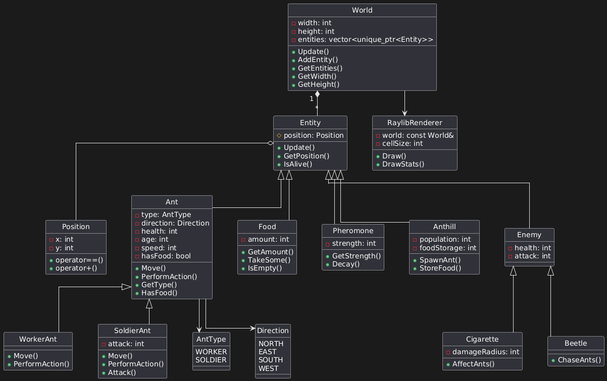

# Ant Life Simulator

## Итоговое задание к экзамену "Симулятор жизни муравьёв"

### Описание проекта

Создать приложение, в котором симулируется жизнь муравьёв на определённой территории.

### Основные характеристики:

- **Пространство**:
    - Прямоугольная область.
    - Двухмерное пространство.
    - Состоит из квадратных клеток (регулярная квадратная сетка).
    - Все объекты помещаются строго в клетки, но могут быть объекты, занимающие несколько клеток (все фрагменты таких объектов выровнены по клеткам).
    - У всех объектов есть характеристика "Положение в пространстве" (координаты).

- **Объекты**:
    - **Муравей**:
        - Направления: "Север", "Восток", "Юг", "Запад".
        - Движение: в 4-х направлениях.
        - Действия: оставлять феромоновый след, съедать частички пищи, залезать и вылезать из муравейника.
        - Типы:
            - **Работник**: может нести частичку пищи.
            - **Воин**: может кусать врага/угрозу.
        - Характеристики:
            - Здоровье (сытость).
            - Возраст.
            - Скорость.
            - Атака (для Воина).

    - **Пища**:
        - Занимает одну клетку.
        - Появляется случайно в случайной позиции, не совпадающей с муравейником.
        - В один момент в пространстве не может быть более N клеток, занятых едой.
        - Характеристики: количество единиц.

    - **Феромоновый след**:
        - Занимает одну клетку.
        - Имеет ареол воздействия S клеток вокруг.
        - Со временем исчезает (уменьшается количество единиц).
        - Характеристики: количество единиц.

    - **Муравейник**:
        - Занимает несколько клеток.
        - Внутренности не обозначаются и не симулируются.
        - Характеристики:
            - Возраст популяции.
            - Размер популяции.
            - Количество собранной пищи.

    - **Враг/Угроза**:
        - Типы:
            - **Окурок**:
                - Неподвижен.
                - Имеет ареол воздействия M клеток вокруг (снижает здоровье муравьёв).
                - Со временем здоровье (целостность) окурка убывает.
                - Характеристики: здоровье (целостность), атака.
            - **Жук**:
                - Направления: "Север", "Восток", "Юг", "Запад".
                - Движение: в 4-х направлениях.
                - Пытается съесть муравьёв.
                - Характеристики: здоровье, атака.

### Требования к реализации:

- Приложение должно быть построено с использованием классов и функций с разбиением на `hpp` и `cpp` файлы.
- Приложение ведёт себя как screensaver, управления симуляцией со стороны пользователя не предполагается.

### Заметки:

- Муравей "Воин" может разрушать окурок, но окурок наносит урон такому муравью всё равно.

---

Этот проект предназначен для симуляции жизни муравьёв в заданной территории с различными объектами и взаимодействиями.

## Примерная структура проекта

 
<!-- 
AntWorld/
├── CMakeLists.txt
├── README.md
├── include/
│   ├── core/
│   │   ├── World.hpp
│   │   ├── Config.hpp
│   │   └── Utils.hpp
│   ├── entities/
│   │   ├── Entity.hpp
│   │   ├── Ant/
│   │   │   ├── Ant.hpp
│   │   │   ├── WorkerAnt.hpp
│   │   │   └── SoldierAnt.hpp
│   │   ├── Food.hpp
│   │   ├── Pheromone.hpp
│   │   ├── Anthill.hpp
│   │   ├── Enemy/
│   │   │   ├── Enemy.hpp
│   │   │   ├── Cigarette.hpp
│   │   │   └── Beetle.hpp
│   │   └── Position.hpp
│   └── rendering/
│       ├── Renderer.hpp
│       └── RaylibRenderer.hpp
└── src/
├── main.cpp
├── core/
│   ├── World.cpp
└── entities/
├── Ant/
│   └── Ant.cpp
├── Food.cpp
├── Pheromone.cpp
├── Anthill.cpp
└── Enemy/
└── Enemy.cpp
-->


## Основные компоненты

### Ядро (`include/core/`)
- `World.hpp` - управление игровым миром и симуляцией
- `Config.hpp` - настройки баланса и константы
- `Utils.hpp` - вспомогательные утилиты

### Сущности (`include/entities/`)
- `Entity.hpp` - базовый класс всех объектов
- `Ant/` - иерархия классов муравьёв
    - `Ant.hpp` - базовый класс
    - `WorkerAnt.hpp` - муравей-работник
    - `SoldierAnt.hpp` - муравей-воин
- `Enemy/` - враги
    - `Cigarette.hpp` - окурок
    - `Beetle.hpp` - жук
- Ресурсы:
    - `Food.hpp` - пища
    - `Pheromone.hpp` - феромоны
    - `Anthill.hpp` - муравейник

### Отрисовка (`include/rendering/`)
- `Renderer.hpp` - абстрактный рендерер
- `RaylibRenderer.hpp` - реализация через raylib

## Сборка

```bash
mkdir build && cd build
cmake ..
make
```
